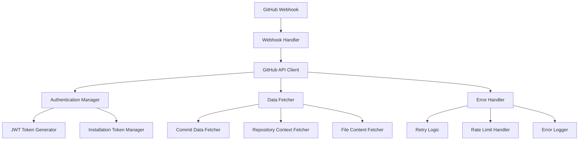

# Design Document

## Overview

This design addresses the GitHub API integration issues in the commit analysis system. The current implementation has a GitHub API client but lacks proper configuration, error handling, and comprehensive data fetching capabilities. The design focuses on creating a robust, well-configured GitHub integration that can reliably fetch commit data, repository information, and handle various edge cases.

## Architecture

### Current State Analysis

The existing system has:
- `GitHubAPIClient` class with basic JWT authentication
- GitHub webhook handler that processes push events
- Missing environment configuration for GitHub App credentials
- Limited error handling and retry logic
- Incomplete commit data fetching (patches are mocked)

### Proposed Architecture



## Components and Interfaces

### 1. Enhanced GitHubAPIClient

**Purpose:** Central client for all GitHub API interactions with improved error handling and data fetching.

**Key Methods:**
- `authenticate()` - Handle GitHub App authentication flow
- `fetch_commit_data(owner, repo, sha)` - Get comprehensive commit information
- `fetch_repository_context(owner, repo)` - Get repository metadata and structure
- `fetch_file_contents(owner, repo, path, ref)` - Get file content at specific commit
- `handle_rate_limits()` - Manage API rate limiting

### 2. Configuration Manager

**Purpose:** Manage environment configuration and validation for GitHub integration.

**Key Methods:**
- `validate_config()` - Validate all required environment variables
- `get_github_credentials()` - Retrieve and validate GitHub App credentials
- `get_fallback_config()` - Provide test/mock configuration options

### 3. Enhanced Webhook Handler

**Purpose:** Process GitHub webhooks with improved data extraction and error handling.

**Key Improvements:**
- Real patch data fetching instead of mocked content
- Better error handling for malformed webhooks
- Support for different event types beyond push events
- Improved logging and monitoring

### 4. Data Enrichment Service

**Purpose:** Enrich webhook data with additional context from GitHub API.

**Key Methods:**
- `enrich_commit_data(webhook_data)` - Add patch data, file contents, and context
- `get_repository_structure(owner, repo)` - Fetch repository file structure
- `get_related_files(changed_files)` - Find related test files and dependencies

## Data Models

### Enhanced Commit Data Structure

```python
@dataclass
class EnhancedCommitData:
    # Basic webhook data
    repo_name: str
    repo_owner: str
    commit_id: str
    commit_message: str
    committer: str
    timestamp: str
    
    # Enhanced data from API
    patches: Dict[str, str]  # file_path -> patch_content
    file_contents: Dict[str, str]  # file_path -> full_content
    repository_context: Dict[str, Any]  # repo metadata
    related_files: List[str]  # test files, configs, etc.
    
    # Analysis metadata
    fetch_errors: List[str]  # Any errors during data fetching
    data_completeness: float  # Percentage of data successfully fetched
```

### Configuration Model

```python
@dataclass
class GitHubConfig:
    app_id: str
    private_key: str
    webhook_secret: Optional[str]
    api_base_url: str = "https://api.github.com"
    max_retries: int = 3
    rate_limit_buffer: int = 10  # requests to keep in reserve
    mock_mode: bool = False
```

## Error Handling

### Error Categories

1. **Authentication Errors**
   - Invalid GitHub App credentials
   - Expired tokens
   - Insufficient permissions

2. **API Errors**
   - Rate limit exceeded
   - Repository not found
   - Network timeouts

3. **Data Errors**
   - Malformed webhook payloads
   - Missing commit data
   - Large diff handling

### Error Handling Strategy

```python
class GitHubAPIError(Exception):
    def __init__(self, message: str, error_type: str, retry_after: Optional[int] = None):
        self.message = message
        self.error_type = error_type
        self.retry_after = retry_after
        super().__init__(message)

class ErrorHandler:
    def handle_api_error(self, error: requests.RequestException) -> GitHubAPIError:
        # Convert requests errors to structured GitHub API errors
        pass
    
    def should_retry(self, error: GitHubAPIError) -> bool:
        # Determine if error is retryable
        pass
    
    def get_backoff_delay(self, attempt: int) -> float:
        # Calculate exponential backoff delay
        pass
```

## Testing Strategy

### Unit Tests

1. **Authentication Tests**
   - JWT token generation
   - Installation token retrieval
   - Token refresh logic

2. **API Client Tests**
   - Successful API calls
   - Error handling scenarios
   - Rate limit handling

3. **Data Fetching Tests**
   - Commit data retrieval
   - Repository context fetching
   - File content fetching

### Integration Tests

1. **End-to-End Webhook Processing**
   - Real webhook payload processing
   - Complete data enrichment flow
   - Error recovery scenarios

2. **GitHub API Integration**
   - Real API calls with test repositories
   - Rate limit behavior
   - Authentication flow

### Mock Testing

1. **Offline Testing**
   - Mock GitHub API responses
   - Simulated error conditions
   - Performance testing with large datasets

## Implementation Phases

### Phase 1: Configuration and Authentication
- Fix environment configuration
- Implement proper GitHub App authentication
- Add configuration validation

### Phase 2: Enhanced Data Fetching
- Implement real patch data fetching
- Add repository context retrieval
- Enhance commit data structure

### Phase 3: Error Handling and Resilience
- Add comprehensive error handling
- Implement retry logic with backoff
- Add rate limit management

### Phase 4: Testing and Validation
- Create comprehensive test suite
- Add integration tests
- Implement mock testing capabilities

## Security Considerations

1. **Credential Management**
   - Store private keys securely
   - Validate webhook signatures
   - Use least-privilege GitHub App permissions

2. **Data Handling**
   - Sanitize webhook payloads
   - Validate API responses
   - Handle sensitive repository data appropriately

3. **Rate Limiting**
   - Respect GitHub API rate limits
   - Implement proper backoff strategies
   - Monitor API usage patterns